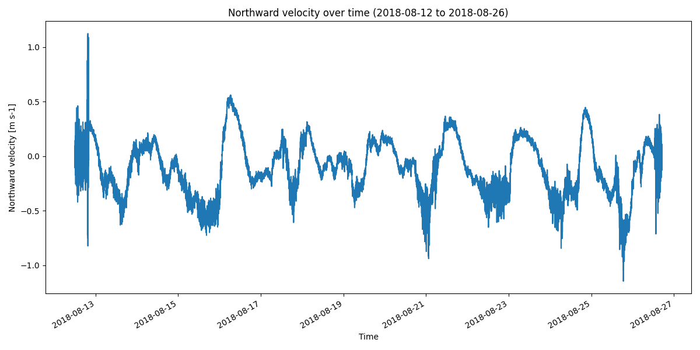

DSC18_477102 Dataset Report
===========================

*Generated: 2026-02-13 08:15:57 UTC*

Dataset Overview
^^^^^^^^^^^^^^^^

- **Source File**: examples/DSC18_477102.dat
- **Original Format**: Nortek ASCII
- **Reader**: NortekAsciiReader
- **Total Variables**: 27
- **Total Coordinates**: 1
- **Dataset Size**: 4.37 MB

- **Time Coverage**: 2018-08-12 to 2018-08-26
- **Record Length**: 20,462 observations
- **Sampling Frequency**: 1min

Dataset Visualization
^^^^^^^^^^^^^^^^^^^^

   Time Series plot showing north_velocity, east_velocity.
   Sampling frequency: 1.0 minutes.

Coordinate Information
^^^^^^^^^^^^^^^^^^^^^^

The following table shows information about dataset coordinates:

.. list-table::
   :widths: 16 16 16 16 16 16
   :header-rows: 1

   * - Coordinate
     - Description
     - Units
     - Shape
     - Min Value
     - Max Value
   * - **time**
     - Time
     - unknown
     - (20462,)
     - 2018-08-12T12:00:00
     - 2018-08-26T17:02:00

Variable Information
^^^^^^^^^^^^^^^^^^^^

The following table shows variable mappings from original to standardized names,
along with key statistics for each variable.

.. list-table::
   :widths: 15 15 15 15 15 15 15
   :header-rows: 1

   * - Variable
     - Description
     - Units
     - Shape
     - Min Value
     - Max Value
     - Missing %
   * - **temperature**
     - Temperature
     - degC
     - (20462,)
     - 0.220
     - 20.250
     - 0.0%
   * - *pressure* → **pressure_1**
     - Pressure
     - dbar
     - (20462,)
     - 0.000
     - 1015.870
     - 0.0%
   * - *Pressure_1* → **pressure_2**
     - Pressure
     - dbar
     - (20462,)
     - 0.000
     - 1007.824
     - 0.0%
   * - **east_velocity**
     - Eastward velocity
     - m s-1
     - (20462,)
     - -1.021
     - 1.072
     - 0.0%
   * - **north_velocity**
     - Northward velocity
     - m s-1
     - (20462,)
     - -1.146
     - 1.124
     - 0.0%
   * - **up_velocity**
     - Upward velocity
     - m s-1
     - (20462,)
     - -1.846
     - 1.530
     - 0.0%
   * - **east_amplitude**
     - east_amplitude
     - unknown
     - (20462,)
     - 22.000
     - 180.000
     - 0.0%
   * - **north_amplitude**
     - north_amplitude
     - unknown
     - (20462,)
     - 21.000
     - 172.000
     - 0.0%
   * - **up_amplitude**
     - up_amplitude
     - unknown
     - (20462,)
     - 21.000
     - 175.000
     - 0.0%
   * - **speed_of_sound**
     - Speed of sound in sea water
     - m s-1
     - (20462,)
     - 1450.100
     - 1522.100
     - 0.0%
   * - **Analog input 1**
     - Analog input 1
     - unknown
     - (20462,)
     - 0.000
     - 0.000
     - 0.0%
   * - **Analog input 2**
     - Analog input 2
     - unknown
     - (20462,)
     - 14501.000
     - 15221.000
     - 0.0%
   * - **Battery voltage**
     - Battery voltage
     - unknown
     - (20462,)
     - 12.300
     - 13.700
     - 0.0%
   * - **Day**
     - Day
     - unknown
     - (20462,)
     - 12.000
     - 26.000
     - 0.0%
   * - **Direction**
     - Direction
     - unknown
     - (20462,)
     - 0.000
     - 359.630
     - 0.0%
   * - **Error code**
     - Error code
     - unknown
     - (20462,)
     - 0.000
     - 0.000
     - 0.0%
   * - **Heading**
     - Heading
     - unknown
     - (20462,)
     - 0.000
     - 359.700
     - 0.0%
   * - **Hour**
     - Hour
     - unknown
     - (20462,)
     - 0.000
     - 23.000
     - 0.0%
   * - **Minute**
     - Minute
     - unknown
     - (20462,)
     - 0.000
     - 59.000
     - 0.0%
   * - **Month**
     - Month
     - unknown
     - (20462,)
     - 8.000
     - 8.000
     - 0.0%
   * - **Pitch**
     - Pitch
     - unknown
     - (20462,)
     - -38.400
     - 40.700
     - 0.0%
   * - **Roll**
     - Roll
     - unknown
     - (20462,)
     - -39.800
     - 38.400
     - 0.0%
   * - **Second**
     - Second
     - unknown
     - (20462,)
     - 0.000
     - 0.000
     - 0.0%
   * - **Soundspeed used**
     - Soundspeed used
     - unknown
     - (20462,)
     - 1466.300
     - 1522.200
     - 0.0%
   * - **Speed**
     - Speed
     - unknown
     - (20462,)
     - 0.003
     - 1.232
     - 0.0%
   * - **Status code**
     - Status code
     - unknown
     - (20462,)
     - 100000.000
     - 111101.000
     - 0.0%
   * - **Year**
     - Year
     - unknown
     - (20462,)
     - 2018.000
     - 2018.000
     - 0.0%

Sensor Variables
^^^^^^^^^^^^^^^^

The following table shows sensor metadata variables that contain
instrument information and calibration details.

No sensor variables found.

Processing Protocol
^^^^^^^^^^^^^^^^^^

This section documents the processing pipeline applied to transform the raw data.

**Pipeline Stages Applied:**

1. mapping
2. unit_handling
3. derivation
4. metadata_extraction
5. metadata_enrichment
6. validation
7. finalization

**Handlers Applied:**

- mapping:default_mapping
- mapping:regex_mapping
- unit_handling:normalize
- metadata_extraction:attributes
- metadata_extraction:global_attributes
- metadata_enrichment:cf
- metadata_enrichment:acdd
- metadata_enrichment:acdd_auto
- metadata_enrichment:whp
- metadata_enrichment:user_metadata
- validation:cf
- validation:unit
- finalization:raw_metadata
- finalization:processor_metadata
- finalization:global_attributes
- finalization:sorting

**Variable Name Mappings:**

- ``Pressure_1`` → ``pressure_2``
- ``pressure`` → ``pressure_1``

**Unit Conversions:**

- east_velocity: m/s -> m s-1
- north_velocity: m/s -> m s-1
- up_velocity: m/s -> m s-1
- speed_of_sound: m/s -> m s-1
- pressure_1: dbar -> dbar
- temperature: ITS-90, deg C -> degC

Global Metadata
^^^^^^^^^^^^^^^

Complete dataset metadata with processing annotations:

- **Title**: Level-1 dataset from Nortek ASCII file between 2018-08-12 and 2018-08-26
- **Summary**: Level-1 dataset decoded from Nortek ASCII file with canonical variable names and units; RAW metadata preserved verbatim; no quality control applied. Time coverage: 2018-08-12T12:00:00 to 2018-08-26T17:02:00. Variables include: Analog input 1, Analog input 2, Battery voltage, Day, Direction, Error code, Heading, Hour, and 17 more.
- **Time Coverage Start**: 2018-08-12T12:00:00
- **Time Coverage End**: 2018-08-26T17:02:00
- **Time Coverage Duration**: PT1227720S
- **Time Coverage Resolution**: PT60S
- **Conventions**: ACDD-1.3, CF-1.13
- **Standard Name Vocabulary**: CF-1.13
- **Featuretype**: timeSeries
- **Cdm Data Type**: TimeSeries
- **Date Created**: 2026-02-13T08:15:57.158490Z
- **Date Modified**: 2026-02-13T08:15:57.158490Z
- **History**: 2026-02-13T08:15:57.158490Z - Processed by SeaSenseLib v0.4.0; Reader: NortekAsciiReader; Format: Nortek ASCII; Source file: DSC18_477102.dat; Stages: mapping, unit_handling, derivation, metadata_extraction, metadata_enrichment, validation, finalization; Mapped 2 variables
- **Keywords**: oceanography, in situ, level-1, ascii, dat, nortek, analog_input_1, analog_input_2, battery_voltage, day, direction, error_code
- **Raw Format**: nortek-ascii
- **Raw Filename**: DSC18_477102.dat
- **Processing Level**: L1
- **Raw Filesize Bytes**: 3581409
- **Raw Mtime Utc**: 2025-11-26T07:52:02.369300Z
- **Raw Sha256**: 027b67de0dee8d07e515597ad8a4121826411bf15b1c5c32b5b137b9b6180c76
- **Raw Metadata Schema**: seasenselib/raw-opaque-1.0
- **Raw Metadata**: {"schema": "seasenselib/raw-opaque-1.0", "raw_format": "nortek-ascii", "raw_filename": "DSC18_477102.dat", "blocks": {"header": null, "calibration": null, "configuration": null, "other": {"global_attributes": {"source_format_name": "Nortek ASCII", "acdd_autogen_fields": "title,summary,keywords"}, "variables": {}}}}
- **Processor Name**: SeaSenseLib
- **Processor Version**: 0.4.0
- **Processor Level**: L1
- **Processor Module**: seasenselib.readers.nortek_ascii_reader
- **Processor Module Name**: Nortek ASCII
- **Processor Module Key**: nortek-ascii
- **Processor Runtime**: CPython
- **Processor Runtime Version**: 3.11.7
- **Processor Execution Time Utc**: 2026-02-13T08:15:57.158452Z
- **Processor Machine**: MacBookPro
- **Processor Os**: Darwin 25.2.0
