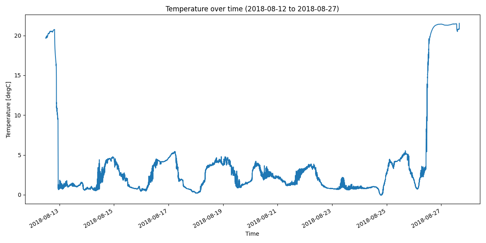

DSE18_101647_20180827_1551 Dataset Report
=========================================

*Generated: 2026-02-13 08:06:24 UTC*

Dataset Overview
^^^^^^^^^^^^^^^^

- **Total Variables**: 3
- **Total Coordinates**: 1
- **Dataset Size**: 3.00 MB

- **Time Coverage**: 2018-08-12 to 2018-08-27
- **Record Length**: 130,987 observations
- **Sampling Frequency**: 0min

Dataset Visualization
^^^^^^^^^^^^^^^^^^^^

   Time Series plot showing temperature.
   Sampling frequency: 0.0 minutes.

Coordinate Information
^^^^^^^^^^^^^^^^^^^^^^

The following table shows information about dataset coordinates:

.. list-table::
   :widths: 16 16 16 16 16 16
   :header-rows: 1

   * - Coordinate
     - Description
     - Units
     - Shape
     - Min Value
     - Max Value
   * - **time**
     - Time
     - unknown
     - (130987,)
     - 2018-08-12T12:00:00
     - 2018-08-27T15:51:00

Variable Information
^^^^^^^^^^^^^^^^^^^^

The following table shows variable mappings from original to standardized names,
along with key statistics for each variable.

.. list-table::
   :widths: 15 15 15 15 15 15 15
   :header-rows: 1

   * - Variable
     - Description
     - Units
     - Shape
     - Min Value
     - Max Value
     - Missing %
   * - **temperature**
     - **Temperature**: Temperature (SENSOR_TEMP_101647)
     - degC
     - (130987,)
     - -0.063
     - 21.531
     - 0.0%
   * - **datasetID**
     - datasetID
     - unknown
     - (130987,)
     - 1.000
     - 1.000
     - 0.0%

Sensor Variables
^^^^^^^^^^^^^^^^

The following table shows sensor metadata variables that contain
instrument information and calibration details.

.. list-table::
   :widths: 25 25 25 25
   :header-rows: 1

   * - Variable
     - Details
     - Vocabulary
     - Calibration Coefficients
   * - **SENSOR_TEMP_101647**
     - - long_name = RBR Solo T Temperature logger sensor metadata
       - sensor_model = RBR Solo T Temperature logger
       - sensor_maker = RBR
       - serial_number = 101647
     - - **Model**: https://vocab.nerc.ac.uk/collection/L22/current/TOOL1024/
       - **Maker**: http://vocab.nerc.ac.uk/collection/L35/current/MAN0049/
     - N/A

Processing Protocol
^^^^^^^^^^^^^^^^^^

This section documents the processing pipeline applied to transform the raw data.

Global Metadata
^^^^^^^^^^^^^^^

Complete dataset metadata with processing annotations:

- **Title**: Level-1 dataset from RBR RSK Legacy file between 2018-08-12 and 2018-08-27
- **Summary**: Level-1 dataset decoded from RBR RSK Legacy file with canonical variable names and units; RAW metadata preserved verbatim; no quality control applied. Time coverage: 2018-08-12T12:00:00 to 2018-08-27T15:51:00. Variables include: temperature.
- **Time Coverage Start**: 2018-08-12T12:00:00
- **Time Coverage End**: 2018-08-27T15:51:00
- **Time Coverage Duration**: PT1309860S
- **Time Coverage Resolution**: PT10S
- **Conventions**: ACDD-1.3, CF-1.13
- **Standard Name Vocabulary**: CF-1.13
- **Featuretype**: timeSeries
- **Cdm Data Type**: TimeSeries
- **Date Created**: 2026-02-13T08:06:24.810671Z
- **Date Modified**: 2026-02-13T08:06:24.810671Z
- **History**: 2026-02-13T08:06:24.810671Z - Processed by SeaSenseLib v0.4.0; Reader: RbrRskLegacyReader; Format: RBR RSK Legacy; Source file: DSE18_101647_20180827_1551.rsk; Stages: mapping, unit_handling, derivation, metadata_extraction, metadata_enrichment, validation, finalization; Mapped 1 variables
- **Keywords**: oceanography, in situ, level-1, rbr, rsk, temperature
- **Raw Format**: rbr-rsk-legacy
- **Raw Filename**: DSE18_101647_20180827_1551.rsk
- **Processing Level**: L1
- **Raw Filesize Bytes**: 6352896
- **Raw Mtime Utc**: 2025-11-26T07:52:02.388865Z
- **Raw Sha256**: 7251e2023cd66896eeada2b5f994af6525c040ad31e637e00d20839e0b514c9f
- **Raw Metadata Schema**: seasenselib/raw-opaque-1.0
- **Raw Metadata**: {"schema": "seasenselib/raw-opaque-1.0", "raw_format": "rbr-rsk-legacy", "raw_filename": "DSE18_101647_20180827_1551.rsk", "blocks": {"header": null, "calibration": null, "configuration": null, "other": {"global_attributes": {"instrument_model": "RBRsolo", "instrument_serial": 101647, "instrument_firmware_version": "1.0", "instrument_firmware_type": 9, "rsk_version": "1.13.4", "rsk_type": "full", "source_format_name": "RBR RSK Legacy", "acdd_autogen_fields": "title,summary,keywords"}, "variables": {}}}}
- **Processor Name**: SeaSenseLib
- **Processor Version**: 0.4.0
- **Processor Level**: L1
- **Processor Module**: seasenselib.readers.rbr_rsk_legacy_reader
- **Processor Module Name**: RBR RSK Legacy
- **Processor Module Key**: rbr-rsk-legacy
- **Processor Runtime**: CPython
- **Processor Runtime Version**: 3.11.7
- **Processor Execution Time Utc**: 2026-02-13T08:06:24.810185Z
- **Processor Machine**: MacBookPro
- **Processor Os**: Darwin 25.2.0
