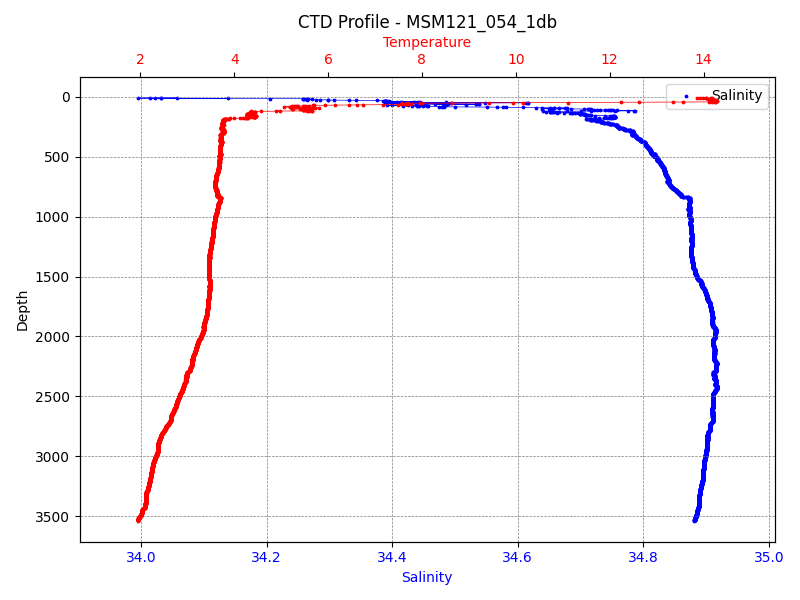

MSM121_054_1db Dataset Report
=============================

*Generated: 2026-02-12 20:28:54 UTC*

Dataset Overview
^^^^^^^^^^^^^^^^

- **Source File**: examples/MSM121_054_1db.cnv
- **Original Format**: SeaBird CNV
- **Reader**: SbeCnvReader
- **Total Variables**: 18
- **Total Coordinates**: 3
- **Dataset Size**: 0.58 MB

- **Time Coverage**: 2000-01-01 to 2000-01-01
- **Record Length**: 3,593 observations
- **Sampling Frequency**: 0min

Dataset Visualization
^^^^^^^^^^^^^^^^^^^^

   Ctd Depth Profile plot showing temperature and salinity vs depth.
   Sampling frequency: 0.0 minutes.

Coordinate Information
^^^^^^^^^^^^^^^^^^^^^^

The following table shows information about dataset coordinates:

.. list-table::
   :widths: 16 16 16 16 16 16
   :header-rows: 1

   * - Coordinate
     - Description
     - Units
     - Shape
     - Min Value
     - Max Value
   * - **latitude**
     - Latitude
     - degrees_north
     - (3593,)
     - 49.70834
     - 49.71112
   * - **longitude**
     - Longitude
     - degrees_east
     - (3593,)
     - -45.00409
     - -45.00073
   * - **time**
     - Time
     - unknown
     - (3593,)
     - 2000-01-01T12:28:34
     - 2000-01-01T13:29:55

Variable Information
^^^^^^^^^^^^^^^^^^^^

The following table shows variable mappings from original to standardized names,
along with key statistics for each variable.

.. list-table::
   :widths: 15 15 15 15 15 15 15
   :header-rows: 1

   * - Variable
     - Description
     - Units
     - Shape
     - Min Value
     - Max Value
     - Missing %
   * - *c0mS/cm* → **conductivity_1**
     - Conductivity
     - mS/cm
     - (3593,)
     - 32.109
     - 41.581
     - 0.0%
   * - *c1mS/cm* → **conductivity_2**
     - Conductivity
     - mS/cm
     - (3593,)
     - 32.108
     - 41.580
     - 0.0%
   * - **conservative_temperature_1**
     - Conservative Temperature
     - degC
     - (3593,)
     - 1.653
     - 14.286
     - 0.0%
   * - **conservative_temperature_2**
     - Conservative Temperature
     - degC
     - (3593,)
     - 1.652
     - 14.285
     - 0.0%
   * - **density**
     - Sea Water Density
     - kg m-3
     - (3593,)
     - 1025.326
     - 1044.021
     - 0.0%
   * - **depth**
     - Depth
     - meters
     - (3593,)
     - -3538.187
     - -6.940
     - 0.0%
   * - **flag**
     - flag
     - unknown
     - (3593,)
     - 0.000
     - 0.000
     - 0.0%
   * - *sbeox0ML/L* → **oxygen_1**
     - Oxygen
     - ml/l
     - (3593,)
     - 4.345
     - 6.970
     - 0.0%
   * - *sbeox1ML/L* → **oxygen_2**
     - Oxygen
     - ml/l
     - (3593,)
     - 4.226
     - 6.808
     - 0.0%
   * - **potential_temperature_1**
     - Potential Temperature
     - degree_C
     - (3593,)
     - 1.655
     - 14.282
     - 0.0%
   * - **potential_temperature_2**
     - Potential Temperature
     - degree_C
     - (3593,)
     - 1.655
     - 14.281
     - 0.0%
   * - *prDM* → **pressure**
     - Pressure
     - db
     - (3593,)
     - 7.000
     - 3599.000
     - 0.0%
   * - *sal11* → **salinity**
     - Salinity
     - 1
     - (3593,)
     - 33.994
     - 34.917
     - 0.0%
   * - **speed_of_sound**
     - Speed of Sound in Sea Water
     - m s-1
     - (3593,)
     - 1468.163
     - 1518.491
     - 0.0%
   * - *t090C* → **temperature_1**
     - Temperature
     - degC
     - (3593,)
     - 1.944
     - 14.286
     - 0.0%
   * - *t190C* → **temperature_2**
     - Temperature
     - degC
     - (3593,)
     - 1.943
     - 14.286
     - 0.0%
   * - **timeQ**
     - timeQ
     - seconds
     - (3593,)
     - 750083314.000
     - 750086995.000
     - 0.0%
   * - **timeS**
     - timeS
     - seconds
     - (3593,)
     - 134.461
     - 3815.453
     - 0.0%

Processing Protocol
^^^^^^^^^^^^^^^^^^

This section documents the processing pipeline applied to transform the raw data.

**Pipeline Stages Applied:**

1. mapping
2. unit_handling
3. derivation
4. metadata_extraction
5. metadata_enrichment
6. validation
7. finalization

**Handlers Applied:**

- mapping:default_mapping
- mapping:regex_mapping
- unit_handling:normalize
- derivation:density
- derivation:depth
- derivation:potential_temperature
- derivation:conservative_temperature
- derivation:speed_of_sound
- metadata_extraction:attributes
- metadata_extraction:global_attributes
- metadata_enrichment:cf
- metadata_enrichment:acdd
- metadata_enrichment:acdd_auto
- metadata_enrichment:whp
- metadata_enrichment:user_metadata
- validation:cf
- validation:unit
- finalization:raw_metadata
- finalization:processor_metadata
- finalization:global_attributes
- finalization:sorting

**Variable Name Mappings:**

- ``c0mS/cm`` → ``conductivity_1``
- ``c1mS/cm`` → ``conductivity_2``
- ``prDM`` → ``pressure``
- ``sal11`` → ``salinity``
- ``sbeox0ML/L`` → ``oxygen_1``
- ``sbeox1ML/L`` → ``oxygen_2``
- ``t090C`` → ``temperature_1``
- ``t190C`` → ``temperature_2``

**Derived Parameters:**

- density
- depth
- potential_temperature_1
- potential_temperature_2
- conservative_temperature_1
- conservative_temperature_2
- speed_of_sound

**Unit Conversions:**

- temperature_1: ITS-90, deg C -> degC
- temperature_2: ITS-90, deg C -> degC
- salinity: PSU -> 1

Global Metadata
^^^^^^^^^^^^^^^

Complete dataset metadata with processing annotations:

- **Conventions**: ACDD-1.3, CF-1.13
- **Cdm Data Type**: TimeSeries
- **Date Created**: 2026-02-12T20:28:54.030404Z
- **Date Modified**: 2026-02-12T20:28:54.030404Z
- **Featuretype**: timeSeries
- **Geospatial Lat Max**: 49.71112
- **Geospatial Lat Min**: 49.70834
- **Geospatial Lon Max**: -45.00073
- **Geospatial Lon Min**: -45.00409
- **Geospatial Vertical Max**: -6.940067223004776
- **Geospatial Vertical Min**: -3538.186649759045
- **Geospatial Vertical Positive**: down
- **History**: 2026-02-12T20:28:54.030404Z - Processed by SeaSenseLib v0.4.0; Reader: SbeCnvReader; Format: SeaBird CNV; Source file: MSM121_054_1db.cnv; Stages: mapping, unit_handling, derivation, metadata_extraction, metadata_enrichment, validation, finalization; Mapped 8 variables; Derived: density, depth, potential_temperature_1, potential_temperature_2, conservative_temperature_1, conservative_temperature_2, speed_of_sound
- **Keywords**: oceanography, in situ, level-1, cnv, seabird, conductivity, conservative_temperature, density, depth, oxygen, potential_temperature
- **Processing Level**: L1
- **Processor Execution Time Utc**: 2026-02-12T20:28:54.030392Z
- **Processor Level**: L1
- **Processor Machine**: MacBookPro
- **Processor Module**: seasenselib.readers.sbe_cnv_reader
- **Processor Module Key**: sbe-cnv
- **Processor Module Name**: SeaBird CNV
- **Processor Name**: SeaSenseLib
- **Processor Os**: Darwin 25.2.0
- **Processor Runtime**: CPython
- **Processor Runtime Version**: 3.11.7
- **Processor Version**: 0.4.0
- **Raw Filename**: MSM121_054_1db.cnv
- **Raw Filesize Bytes**: 529091
- **Raw Format**: sbe-cnv
- **Raw Metadata**: [JSON structure with keys: ['schema', 'raw_format', 'raw_filename', 'blocks']...]
- **Raw Metadata Schema**: seasenselib/raw-opaque-1.0
- **Raw Mtime Utc**: 2026-01-05T05:05:13.458080Z
- **Raw Sha256**: 768c3ebf1974bf629fa8d6fcb5e98479323583ea14023b207264b9c7cc121e61
- **Standard Name Vocabulary**: CF-1.13
- **Summary**: Level-1 dataset decoded from SeaBird CNV file with canonical variable names and units; RAW metadata preserved verbatim; no quality control applied. Time coverage: 2000-01-01T12:28:34 to 2000-01-01T13:29:55. Spatial coverage: 49.71–49.71N, 45.00–45.00W. Depth range: -3538.19–-6.94 m. Variables include: conductivity, conservative_temperature, density, depth, oxygen, potential_temperature, pressure, salinity, and 4 more.
- **Time Coverage Duration**: PT3681S
- **Time Coverage End**: 2000-01-01T13:29:55
- **Time Coverage Resolution**: PT1S
- **Time Coverage Start**: 2000-01-01T12:28:34
- **Title**: Level-1 dataset from SeaBird CNV file on 2000-01-01 within 49.71–49.71N, 45.00–45.00W (depth -3538.19–-6.94 m)
