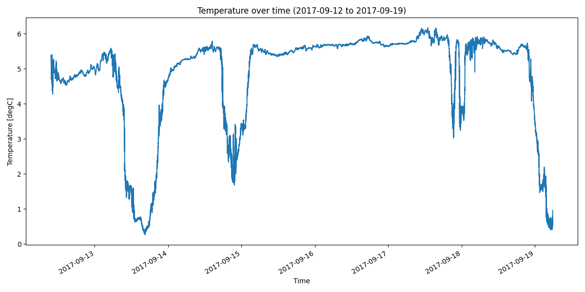

denmark-strait-ds-m1-17 Dataset Report
======================================

*Generated: 2026-02-13 07:17:23 UTC*

Dataset Overview
^^^^^^^^^^^^^^^^

- **Source File**: examples/denmark-strait-ds-m1-17.cnv
- **Original Format**: SeaBird CNV
- **Reader**: SbeCnvReader
- **Total Variables**: 15
- **Total Coordinates**: 3
- **Dataset Size**: 5.86 MB

- **Time Coverage**: 2017-09-12 to 2017-09-19
- **Record Length**: 59,088 observations
- **Sampling Frequency**: 0min

Dataset Visualization
^^^^^^^^^^^^^^^^^^^^

   Time Series plot showing temperature, salinity.
   Sampling frequency: 0.0 minutes.

Coordinate Information
^^^^^^^^^^^^^^^^^^^^^^

The following table shows information about dataset coordinates:

.. list-table::
   :widths: 16 16 16 16 16 16
   :header-rows: 1

   * - Coordinate
     - Description
     - Units
     - Shape
     - Min Value
     - Max Value
   * - **latitude**
     - Latitude
     - degrees_north
     - ()
     - 65.5245
     - 65.5245
   * - **longitude**
     - Longitude
     - degrees_east
     - ()
     - -29.488166666666668
     - -29.488166666666668
   * - **time**
     - Time
     - unknown
     - (59088,)
     - 2017-09-12T09:40:29
     - 2017-09-19T05:48:19

Variable Information
^^^^^^^^^^^^^^^^^^^^

The following table shows variable mappings from original to standardized names,
along with key statistics for each variable.

.. list-table::
   :widths: 15 15 15 15 15 15 15
   :header-rows: 1

   * - Variable
     - Description
     - Units
     - Shape
     - Min Value
     - Max Value
     - Missing %
   * - *tv290C* → **temperature**
     - Temperature (SENSOR_TEMP_7512)
     - degC
     - (59088,)
     - 0.264
     - 6.163
     - 0.0%
   * - *cond0mS/cm* → **conductivity**
     - Conductivity (SENSOR_CNDC_7512)
     - mS/cm
     - (59088,)
     - 29.482
     - 34.793
     - 0.0%
   * - *prdM* → **pressure**
     - Pressure (SENSOR_PRES_2075219)
     - db
     - (59088,)
     - 579.968
     - 742.004
     - 0.0%
   * - **depth**
     - Depth
     - meters
     - (59088,)
     - -733.391
     - -573.459
     - 0.0%
   * - **density**
     - Sea Water Density
     - kg m-3
     - (59088,)
     - 1030.056
     - 1031.302
     - 0.0%
   * - **potential_temperature**
     - Potential Temperature
     - degree_C
     - (59088,)
     - 0.236
     - 6.108
     - 0.0%
   * - *sal00* → **salinity**
     - Salinity
     - 1
     - (59088,)
     - 34.356
     - 35.740
     - 0.0%
   * - **conservative_temperature**
     - Conservative Temperature
     - degC
     - (59088,)
     - 0.236
     - 6.100
     - 0.0%
   * - **speed_of_sound**
     - Speed of Sound in Sea Water
     - m s-1
     - (59088,)
     - 1460.558
     - 1485.440
     - 0.0%
   * - *timeJV2* → **timeJ**
     - timeJ
     - julian days
     - (59088,)
     - 258.490
     - 265.328
     - 0.0%
   * - **flag**
     - flag
     - unknown
     - (59088,)
     - 0.000
     - 0.000
     - 0.0%
   * - **scan**
     - scan
     - unknown
     - (59088,)
     - 26669.000
     - 85756.000
     - 0.0%

Sensor Variables
^^^^^^^^^^^^^^^^

The following table shows sensor metadata variables that contain
instrument information and calibration details.

.. list-table::
   :widths: 25 25 25 25
   :header-rows: 1

   * - Variable
     - Details
     - Vocabulary
     - Calibration Coefficients
   * - **SENSOR_CNDC_7512**
     - - long_name = Sea-Bird SBE 4C conductivity sensor sensor metadata
       - sensor_model = Sea-Bird SBE 4C conductivity sensor
       - sensor_maker = Sea-Bird Scientific
       - serial_number = 7512
       - calibration_date = 2009-12-31
       - channel = 2
     - - **Type**: http://vocab.nerc.ac.uk/collection/L05/current/133/
       - **Model**: https://vocab.nerc.ac.uk/collection/L22/current/TOOL0417/
       - **Maker**: http://vocab.nerc.ac.uk/collection/L35/current/MAN0013/
     - - **CONDUCTIVITY**: G=-1.05899100e+000, H=1.39862700e-001, I=-2.03109500e-004, J=3.27035400e-005, CPcor=-9.57000000e-008, CTcor=3.2500e-006, WBOTC=2.41993100e-007, Slope=1.00000000, Offset=0.00000
   * - **SENSOR_PRES_2075219**
     - - long_name = Sea-Bird pressure sensor sensor metadata
       - sensor_model = Sea-Bird pressure sensor
       - sensor_maker = Sea-Bird Scientific
       - serial_number = 2075219
       - calibration_date = 2009-12-21
       - channel = 3
     - - **Type**: http://vocab.nerc.ac.uk/collection/L05/current/138/
       - **Model**: http://vocab.nerc.ac.uk/collection/L22/current/TOOL0420/
       - **Maker**: http://vocab.nerc.ac.uk/collection/L35/current/MAN0013/
     - - **PRESSURE**: PA0=-5.65924300e-001, PA1=9.09087800e-003, PA2=7.97773900e-011, PTCA0=5.21950000e+005, PTCA1=-8.08706600e+000, PTCA2=2.46976300e-001, PTCB0=1.03463500e+002, PTCB1=-7.03554800e-003, PTCB2=0.00000000e+000, PTEMPA0=-9.24305500e+001, PTEMPA1=4.00429700e-002, PTEMPA2=8.29565000e-007
   * - **SENSOR_TEMP_7512**
     - - long_name = Sea-Bird SBE 3plus temperature sensor sensor metadata
       - sensor_model = Sea-Bird SBE 3plus temperature sensor
       - sensor_maker = Sea-Bird Scientific
       - serial_number = 7512
       - calibration_date = 2009-12-31
       - channel = 1
     - - **Type**: http://vocab.nerc.ac.uk/collection/L05/current/134/
       - **Model**: https://vocab.nerc.ac.uk/collection/L22/current/TOOL0416/
       - **Maker**: http://vocab.nerc.ac.uk/collection/L35/current/MAN0013/
     - - **TEMPERATURE**: Slope=1.00000000, Offset=0.0000

Processing Protocol
^^^^^^^^^^^^^^^^^^

This section documents the processing pipeline applied to transform the raw data.

**Pipeline Stages Applied:**

1. mapping
2. unit_handling
3. derivation
4. metadata_extraction
5. metadata_enrichment
6. validation
7. finalization

**Handlers Applied:**

- mapping:default_mapping
- mapping:regex_mapping
- unit_handling:normalize
- derivation:density
- derivation:depth
- derivation:potential_temperature
- derivation:conservative_temperature
- derivation:speed_of_sound
- metadata_extraction:attributes
- metadata_extraction:global_attributes
- metadata_enrichment:cf
- metadata_enrichment:acdd
- metadata_enrichment:acdd_auto
- metadata_enrichment:whp
- metadata_enrichment:user_metadata
- validation:cf
- validation:unit
- finalization:raw_metadata
- finalization:processor_metadata
- finalization:global_attributes
- finalization:sorting

**Variable Name Mappings:**

- ``cond0mS/cm`` → ``conductivity``
- ``prdM`` → ``pressure``
- ``sal00`` → ``salinity``
- ``timeJV2`` → ``timeJ``
- ``tv290C`` → ``temperature``

**Derived Parameters:**

- density
- depth
- potential_temperature
- conservative_temperature
- speed_of_sound

**Unit Conversions:**

- salinity: PSU -> 1
- temperature: ITS-90, deg C -> degC

Global Metadata
^^^^^^^^^^^^^^^

Complete dataset metadata with processing annotations:

- **Conventions**: ACDD-1.3, CF-1.13
- **Cdm Data Type**: TimeSeries
- **Date Created**: 2026-02-13T07:17:23.736034Z
- **Date Modified**: 2026-02-13T07:17:23.736034Z
- **Featuretype**: timeSeries
- **Geospatial Lat Max**: 65.5245
- **Geospatial Lat Min**: 65.5245
- **Geospatial Lon Max**: -29.488166666666668
- **Geospatial Lon Min**: -29.488166666666668
- **Geospatial Vertical Max**: -573.4585222416919
- **Geospatial Vertical Min**: -733.3906869090451
- **Geospatial Vertical Positive**: down
- **History**: 2026-02-13T07:17:23.736034Z - Processed by SeaSenseLib v0.4.0; Reader: SbeCnvReader; Format: SeaBird CNV; Source file: denmark-strait-ds-m1-17.cnv; Stages: mapping, unit_handling, derivation, metadata_extraction, metadata_enrichment, validation, finalization; Mapped 5 variables; Derived: density, depth, potential_temperature, conservative_temperature, speed_of_sound
- **Keywords**: oceanography, in situ, level-1, cnv, seabird, conductivity, conservative_temperature, density, depth, potential_temperature, pressure
- **Processing Level**: L1
- **Processor Execution Time Utc**: 2026-02-13T07:17:23.736009Z
- **Processor Level**: L1
- **Processor Machine**: MacBookPro
- **Processor Module**: seasenselib.readers.sbe_cnv_reader
- **Processor Module Key**: sbe-cnv
- **Processor Module Name**: SeaBird CNV
- **Processor Name**: SeaSenseLib
- **Processor Os**: Darwin 25.2.0
- **Processor Runtime**: CPython
- **Processor Runtime Version**: 3.11.7
- **Processor Version**: 0.4.0
- **Raw Filename**: denmark-strait-ds-m1-17.cnv
- **Raw Filesize Bytes**: 4676171
- **Raw Format**: sbe-cnv
- **Raw Metadata**: {"schema": "seasenselib/raw-opaque-1.0", "raw_format": "sbe-cnv", "raw_filename": "denmark-strait-ds-m1-17.cnv", "blocks": {"header": "* Sea-Bird SBE37SM-RS232  Data File:\n* FileName = D:\\Verankerungen\\Daenemarkstrasse\\2017\\Data\\recoveries\\DS-M2-17_Therm_20170922\\SBE37SM-RS232_03707512_2017_09_22.hex\n* Software version SeatermV2 2.6.1.12\n* Temperature SN = 7512\n* Conductivity SN = 7512\n* System UpLoad Time = Sep 22 2017 09:40:19\n* sample interval = 10 seconds\n* <ApplicationData>\n* <Seaterm232>\n* <SoftwareVersion>2.6.1.12</SoftwareVersion>\n* <BuildDate>30-May-2016</BuildDate>\n* </Seaterm232>\n* </ApplicationData>\n* <InstrumentState>\n* <HardwareData DeviceType='SBE37SM-RS232' SerialNumber='03707512'>\n*\n*    <Manufacturer>Sea-Bird Electronics, Inc.</Manufacturer>\n*\n*    <FirmwareVersion>3.0h</FirmwareVersion>\n*\n*    <FirmwareDate>20 March 2009 09:25</FirmwareDate>\n*\n*    <PCBAssembly>41647</PCBAssembly>\n*\n*    <PCBAssembly>41610B</PCBAssembly>\n*\n*    <PCBAssembly>41611D</PCBAssembly>\n*\n*    <MfgDate>14 Dec 2009</MfgDate>\n*\n*    <FirmwareLoader>SBE 37 FirmwareLoader V 1.0</FirmwareLoader>\n*\n*    <InternalSensors>\n*\n*       <Sensor id='Temperature'>\n*\n*          <type>temperature-1</type>\n*\n*          <SerialNumber>03707512</SerialNumber>\n*\n*       </Sensor>\n*\n*       <Sensor id='Conductivity'>\n*\n*          <type>conductivity-1</type>\n*\n*          <SerialNumber>03707512</SerialNumber>\n*\n*       </Sensor>\n*\n*       <Sensor id='Pressure'>\n*\n*          <type>strain-0</type>\n*\n*          <SerialNumber>2075219</SerialNumber>\n*\n*       </Sensor>\n*\n*    </InternalSensors>\n*\n* </HardwareData>\n* <StatusData DeviceType='SBE37SM-RS232' SerialNumber='03707512'>\n*\n*    <DateTime>2017-09-22T09:15:10</DateTime>\n*\n*    <EventSummary numEvents='10'/>\n*\n*    <Power>\n*\n*       <vMain> 6.95</vMain>\n*\n*       <vLith> 2.95</vLith>\n*\n*    </Power>\n*\n*    <MemorySummary>\n*\n*       <Bytes>1292610</Bytes>\n*\n*       <Samples>86174</Samples>\n*\n*       <SamplesFree>473066</SamplesFree>\n*\n*       <SampleLength>15</SampleLength>\n*\n*    </MemorySummary>\n*\n*    <AutonomousSampling>no, stop command</AutonomousSampling>\n*\n* </StatusData>\n* <ConfigurationData DeviceType='SBE37SM-RS232' SerialNumber='03707512'>\n*\n*    <PressureInstalled>yes</PressureInstalled>\n*\n*    <PumpInstalled>no</PumpInstalled>\n*\n*    <SampleDataFormat>converted engineering</SampleDataFormat>\n*\n*    <OutputSalinity>no</OutputSalinity>\n*\n*    <OutputSV>no</OutputSV>\n*\n*    <TxRealTime>yes</TxRealTime>\n*\n*    <SampleInterval>10</SampleInterval>\n*\n*    <SyncMode>no</SyncMode>\n*\n* </ConfigurationData>\n* <CalibrationCoefficients DeviceType='SBE37SM-RS232' SerialNumber='03707512'>\n*\n*    <Calibration format='TEMP1' id='Temperature'>\n*\n*       <SerialNum>03707512</SerialNum>\n*\n*       <CalDate>31-Dec-09 </CalDate>\n*\n*       <A0>-1.177724e-04</A0>\n*\n*       <A1>3.120822e-04</A1>\n*\n*       <A2>-4.921455e-06</A2>\n*\n*       <A3>2.111638e-07</A3>\n*\n*    </Calibration>\n*\n*    <Calibration format='WBCOND0' id='Conductivity'>\n*\n*       <SerialNum>03707512</SerialNum>\n*\n*       <CalDate>31-Dec-09</CalDate>\n*\n*       <G>-1.058991e+00</G>\n*\n*       <H>1.398627e-01</H>\n*\n*       <I>-2.031095e-04</I>\n*\n*       <J>3.270354e-05</J>\n*\n*       <PCOR>-9.570000e-08</PCOR>\n*\n*       <TCOR>3.250000e-06</TCOR>\n*\n*       <WBOTC>2.419931e-07</WBOTC>\n*\n*    </Calibration>\n*\n*    <Calibration format='STRAIN0' id='Pressure'>\n*\n*       <SerialNum>2075219</SerialNum>\n*\n*       <CalDate>21-Dec-09</CalDate>\n*\n*       <PA0>-5.659243e-01</PA0>\n*\n*       <PA1>9.090878e-03</PA1>\n*\n*       <PA2>7.977739e-11</PA2>\n*\n*       <PTCA0>5.219500e+05</PTCA0>\n*\n*       <PTCA1>-8.087066e+00</PTCA1>\n*\n*       <PTCA2>2.469763e-01</PTCA2>\n*\n*       <PTCB0>1.034635e+02</PTCB0>\n*\n*       <PTCB1>-7.035548e-03</PTCB1>\n*\n*       <PTCB2>0.000000e+00</PTCB2>\n*\n*       <PTEMPA0>-9.243055e+01</PTEMPA0>\n*\n*       <PTEMPA1>4.004297e-02</PTEMPA1>\n*\n*       <PTEMPA2>8.295650e-07</PTEMPA2>\n*\n*       <POFFSET>0.000000e+00</POFFSET>\n*\n*       <PRANGE>2.900000e+03</PRANGE>\n*\n*    </Calibration>\n*\n* </CalibrationCoefficients>\n* <EventCounters DeviceType='SBE37SM-RS232' SerialNumber='03707512'>\n*\n*    <EventSummary numEvents='10'/>\n*\n*    <Event type='PON reset' count='9'/>\n*\n*    <Event type='alarm short' count='1'/>\n*\n* </EventCounters></InstrumentState><UserHeaderInsert>\n* <![CDATA[\n** NMEA Latitude = 65 31.47 N\n** NMEA Longitude = 029 29.29 W\n* ]]>\n* </UserHeaderInsert>\n# nquan = 7\n# nvalues = 86174                                 \n# units = specified\n# name 0 = scan: Scan Count\n# name 1 = prdM: Pressure, Strain Gauge [db]\n# name 2 = cond0mS/cm: Conductivity [mS/cm]\n# name 3 = sal00: Salinity, Practical [PSU]\n# name 4 = tv290C: Temperature [ITS-90, deg C]\n# name 5 = timeJV2: Time, Instrument [julian days]\n# name 6 = flag:  0.000e+00\n# span 0 =          1,      86174                 \n# span 1 =     -1.150,    742.004                 \n# span 2 =  -0.000168,  36.882249                 \n# span 3 =     0.0000,    35.7398                 \n# span 4 =     0.2642,    20.0507                 \n# span 5 = 255.403113, 265.376840                 \n# span 6 = 0.0000e+00, 0.0000e+00                 \n# interval = seconds: 10\n# start_time = Sep 12 2017 09:40:29 [Instrument's time stamp, first data scan]\n# bad_flag = -9.990e-29\n# <Sensors count=\"3\" >\n#   <sensor Channel=\"1\" >\n#     <!-- Count, Temperature -->\n#     <TemperatureSensor SensorID=\"58\" >\n#       <SerialNumber>7512</SerialNumber>\n#       <CalibrationDate>31-Dec-09 </CalibrationDate>\n#       <A0>-1.17772400e-004</A0>\n#       <A1>3.12082200e-004</A1>\n#       <A2>-4.92145500e-006</A2>\n#       <A3>2.11163800e-007</A3>\n#       <Slope>1.00000000</Slope>\n#       <Offset>0.0000</Offset>\n#     </TemperatureSensor>\n#   </sensor>\n#   <sensor Channel=\"2\" >\n#     <!-- Frequency 0, Conductivity -->\n#     <ConductivitySensor SensorID=\"3\" >\n#       <SerialNumber>7512</SerialNumber>\n#       <CalibrationDate>31-Dec-09</CalibrationDate>\n#       <UseG_J>1</UseG_J>\n#       <!-- Cell const and series R are applicable only for wide range sensors. -->\n#       <SeriesR>0.0000</SeriesR>\n#       <CellConst>2000.0000</CellConst>\n#       <ConductivityType>1</ConductivityType>\n#       <Coefficients equation=\"0\" >\n#         <A>0.00000000e+000</A>\n#         <B>0.00000000e+000</B>\n#         <C>0.00000000e+000</C>\n#         <D>0.00000000e+000</D>\n#         <M>0.0</M>\n#         <CPcor>-9.57000000e-008</CPcor>\n#       </Coefficients>\n#       <Coefficients equation=\"1\" >\n#         <G>-1.05899100e+000</G>\n#         <H>1.39862700e-001</H>\n#         <I>-2.03109500e-004</I>\n#         <J>3.27035400e-005</J>\n#         <CPcor>-9.57000000e-008</CPcor>\n#         <CTcor>3.2500e-006</CTcor>\n#         <!-- WBOTC not applicable unless ConductivityType = 1. -->\n#         <WBOTC>2.41993100e-007</WBOTC>\n#       </Coefficients>\n#       <Slope>1.00000000</Slope>\n#       <Offset>0.00000</Offset>\n#     </ConductivitySensor>\n#   </sensor>\n#   <sensor Channel=\"3\" >\n#     <!-- Count, Pressure, Strain Gauge -->\n#     <PressureSensor SensorID=\"46\" >\n#       <SerialNumber>2075219</SerialNumber>\n#       <CalibrationDate>21-Dec-09</CalibrationDate>\n#       <PA0>-5.65924300e-001</PA0>\n#       <PA1>9.09087800e-003</PA1>\n#       <PA2>7.97773900e-011</PA2>\n#       <PTEMPA0>-9.24305500e+001</PTEMPA0>\n#       <PTEMPA1>4.00429700e-002</PTEMPA1>\n#       <PTEMPA2>8.29565000e-007</PTEMPA2>\n#       <PTCA0>5.21950000e+005</PTCA0>\n#       <PTCA1>-8.08706600e+000</PTCA1>\n#       <PTCA2>2.46976300e-001</PTCA2>\n#       <PTCB0>1.03463500e+002</PTCB0>\n#       <PTCB1>-7.03554800e-003</PTCB1>\n#       <PTCB2>0.00000000e+000</PTCB2>\n#       <Offset>0.000000</Offset>\n#     </PressureSensor>\n#   </sensor>\n# </Sensors>\n# datcnv_date = Sep 22 2017 10:39:48, 7.26.2.14 [datcnv_vars = 6]\n# datcnv_in = D:\\Verankerungen\\Daenemarkstrasse\\2017\\Data\\recoveries\\DS-M2-17_Therm_20170922\\Microcat\\SBE37SM-RS232_03707512_2017_09_22.hex D:\\Verankerungen\\Daenemarkstrasse\\2017\\Data\\recoveries\\DS-M2-17_Therm_20170922\\Microcat\\SBE37SM-RS232_03707512_2017_09_22.XMLCON\n# datcnv_skipover = 0\n# file_type = ascii\n*END*", "calibration": null, "configuration": null, "other": {"global_attributes": {"latitude": 65.5245, "longitude": -29.488166666666668, "CreateTime": "2026-02-13T08:17:23.645359+01:00", "CreateTime_UTC": "2026-02-13T07:17:23.645359Z", "DataType": "TimeSeries", "cnv_sbe_model": "SBE 37SM-RS232", "cnv_software_version": "SeatermV2 2.6.1.12", "cnv_start_date": "2017-09-12 09:40:29", "cnv_upload_date": "2017-09-22 09:40:19", "cnv_interval_seconds": 10.0, "cnv_sensor_1": {"channel": 1, "sensor_type": "TemperatureSensor", "serial_number": "7512", "calibration_date": "31-Dec-09 ", "sensor_id": "58"}, "cnv_sensor_2": {"channel": 2, "sensor_type": "ConductivitySensor", "serial_number": "7512", "calibration_date": "31-Dec-09", "sensor_id": "3"}, "cnv_sensor_3": {"channel": 3, "sensor_type": "PressureSensor", "serial_number": "2075219", "calibration_date": "21-Dec-09", "sensor_id": "46"}, "source_format_name": "SeaBird CNV", "acdd_autogen_fields": "title,summary,keywords"}, "variables": {}}}}
w- **Raw Metadata Schema**: seasenselib/raw-opaque-1.0
- **Raw Mtime Utc**: 2025-09-24T06:00:13.531284Z
- **Raw Sha256**: 471157825afc9665e6c9e1c9296d967c15d1a980109248b0fe938d641c7a4d79
- **Standard Name Vocabulary**: CF-1.13
- **Summary**: Level-1 dataset decoded from SeaBird CNV file with canonical variable names and units; RAW metadata preserved verbatim; no quality control applied. Time coverage: 2017-09-12T09:40:29 to 2017-09-19T05:48:19. Spatial coverage: 65.5245N, 29.4882W. Depth range: -733.39–-573.46 m. Variables include: conductivity, conservative_temperature, density, depth, potential_temperature, pressure, salinity, speed_of_sound, and 2 more.
- **Time Coverage Duration**: PT590870S
- **Time Coverage End**: 2017-09-19T05:48:19
- **Time Coverage Resolution**: PT10S
- **Time Coverage Start**: 2017-09-12T09:40:29
- **Title**: Level-1 dataset from SeaBird CNV file between 2017-09-12 and 2017-09-19 at 65.5245N, 29.4882W (depth -733.39–-573.46 m)
